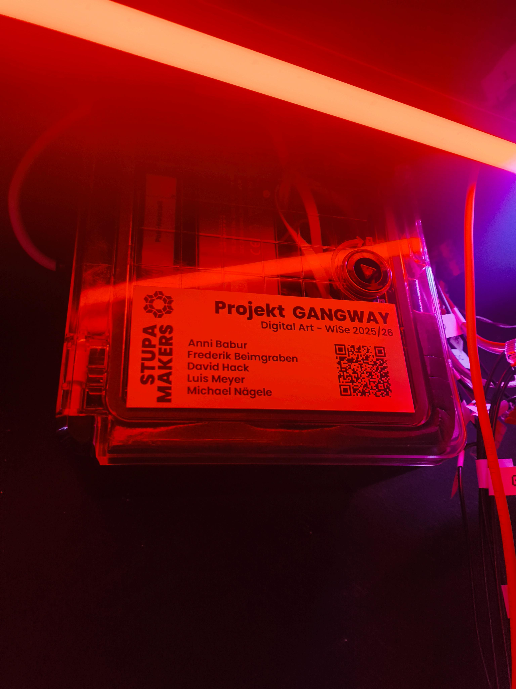
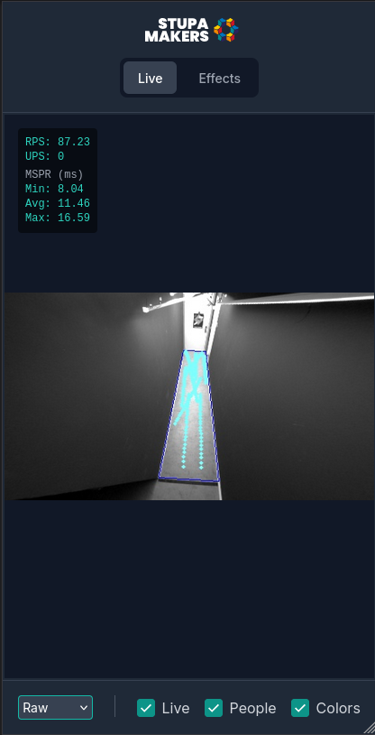
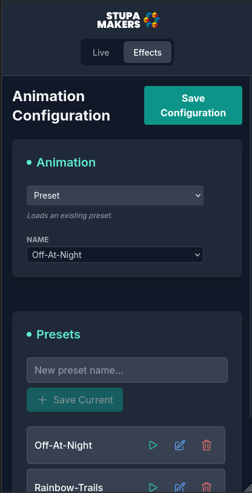
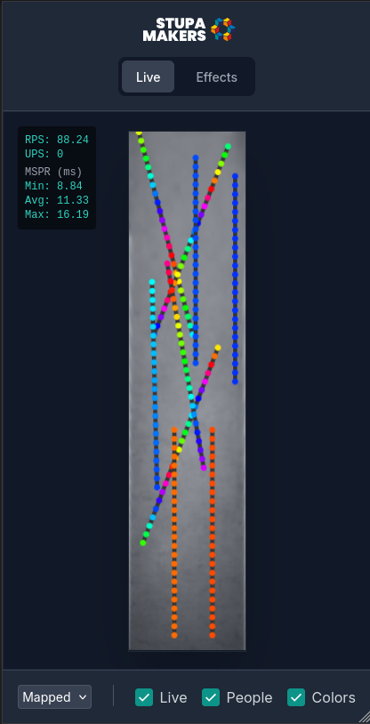

# Gangway Project

This project controls a lighting installation consisting of WS2805 LED strips using a Raspberry Pi 4B. It includes a custom driver implementation and a projection mapping system for complex visual effects that react to people walking through the area.

## Hardware Setup

The system is built around a Raspberry Pi 4B and a large array of LED strips suspended from the ceiling.

### Components
- **Controller**: Raspberry Pi 4B
- **Power System**:
  - Three 24V 300W Power Supplies
  - Step-Down Converter (24V to 5V) to power the Raspberry Pi
- **Lighting**: WS2805 LED strips
- **Mounting**: The strips are mounted on aluminum profiles, arranged in 3 groups of 3, each 2 meters long.
- **Sensor**: XOVIS PC2-L Person Counter

### Wiring and Connectivity
- **Data Signal**: The control signal originates from **GPIO 18** on the Raspberry Pi.
- **Signal Conditioning**: A level shifter is employed between the Raspberry Pi and the LED strips to convert the 3.3V logic to the required level for the LEDs.
- **Topology**: The strips are wired in a daisy-chain configuration.

## Person Detection & Data Flow

To enable interactive lighting effects, the system uses a **XOVIS PC2-L** person counter.

### Data Flow Pipeline
1.  **Acquisition**: The XOVIS sensor detects people in its field of view.
2.  **Push**: The sensor pushes event data (JSON) via HTTP POST to a lightweight web server running within the application (`XOVISServer`) on port 8081.
3.  **Processing**:
    *   The server parses the incoming JSON into event objects.
    *   **Projection Mapping**: Raw coordinates from the sensor are transformed using a homographic projection to match the physical floor plan. This ensures that a person standing at a specific location on the floor triggers the LED strip directly above them.
4.  **Distribution**: The processed coordinates are published to subscribers, primarily the `LEDController`, which updates the rendering state.

## Software

### Custom WS2805 Driver
This project uses a modified version of the `rp-ws281x` library to support the WS2805 protocol. The source code for this modified library can be found in the `rpi-ws2805-python` directory. The license has been updated to reflect these modifications.

### Configuration
The physical layout and logical mapping of the LEDs are defined in `config.yaml`. The system manages 9 distinct strip segments.

**Strip Layout:**

| Index | Length (LEDs) |
|-------|---------------|
| 1     | 24            |
| 25    | 24            |
| 49    | 23            |
| 71    | 24            |
| 97    | 24            |
| 121   | 24            |
| 145   | 24            |
| 169   | 24            |
| 193   | 24            |

The configuration also handles projection mapping parameters (`src_points`, `dst_points`) and defines cutout zones within the projection area.

## Animation System

The animation engine is designed to be procedural and responsive.

### How Animations Work
Animations are defined as Python functions that determine the color of a specific LED at a specific point in time.

*   **Input**:
    *   `time`: Current system time.
    *   `ctx`: Scene context (floor dimensions, LED positions).
    *   `led`: The specific LED being rendered.
    *   `objects`: A list of currently detected people (coordinates).
*   **Output**: An `RGBCCT` color value.

### Rendering Loop
The `LEDController` runs a continuous loop:
1.  It iterates through every LED in the system.
2.  It calls the active animation function for that LED.
3.  It updates the physical strip with the calculated colors.

### Interactive Animations
Responsive animations (e.g., `paint`, `dot`) utilize the `objects` list to calculate distance-based effects. For example, the `paint` animation maintains a history of positions to create trailing light effects that follow people as they move through the gangway.

### Recursive Composition & Meta-Animations

A powerful feature of the system is the ability to nest animations recursively. "Meta-animations" are animations that take other animations as input arguments instead of just colors.

**Benefits:**
*   **Modularity**: Complex behaviors can be built by combining simple building blocks. For example, `blend(rainbow(), sparkle())` creates a sparkly rainbow effect without writing a new dedicated function.
*   **Logic Abstraction**: Control logic is decoupled from visual logic.
    *   `schedule(day_anim, night_anim)`: Switches behavior based on time of day.
    *   `proximity(active_anim, idle_anim)`: Smoothly transitions between effects based on how close a person is to a specific point.
*   **Infinite Depth**: Since a meta-animation conforms to the standard animation interface, it can be wrapped in another meta-animation. You can have a `schedule` that switches between a `blend` and a `proximity` animation.

This functional approach allows for high flexibility and rapid experimentation with visual effects.

## User Interface

A frontend interface is provided to manage animations and settings.

